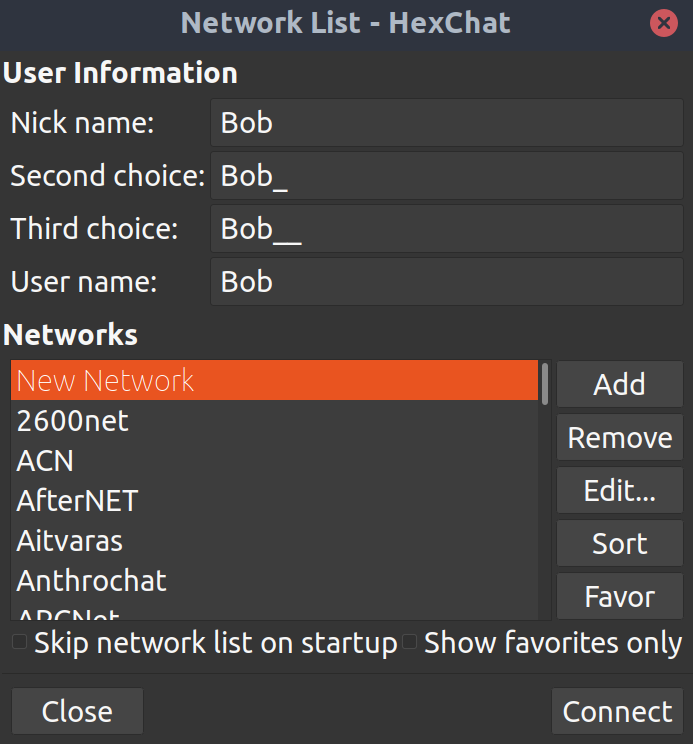
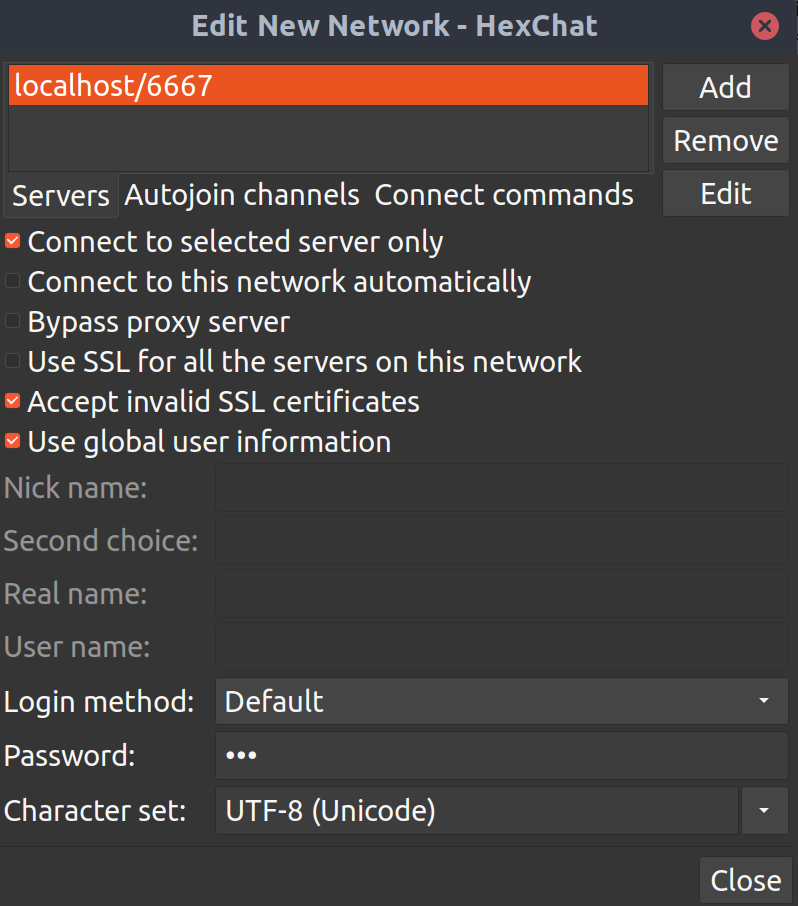
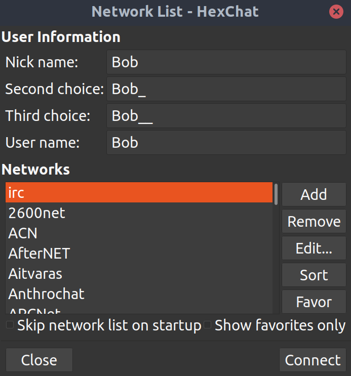
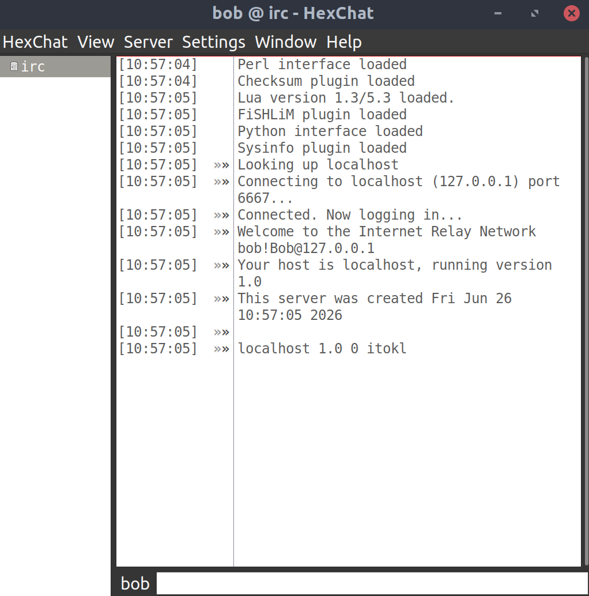

This project has been created as part of the 42 curriculum by nbodin, lpalabos_

## Description  
The goal of this project is to implement a server that can communicate with clients, following the [IRC](https://en.wikipedia.org/wiki/IRC) protocol.  
This project was coded accordingly to the RFCs [1459](https://www.rfc-editor.org/info/rfc1459/), [2811](https://www.rfc-editor.org/info/rfc2811/) and [2812](https://www.rfc-editor.org/info/rfc2812/), as well as the [Modern IRC Docs](https://modern.ircdocs.horse/).  
We used HexChat as the reference client for our server.  
We implemented channel operators, [+itokl] for the channels modes, and the following commands:  
- PASS
- USER
- NICK
- JOIN
- PRIVMSG
- KICK
- INVITE
- TOPIC
- MODE
- WHO
- PART

## Instructions  
### Start the server
To run the project, do:  
```
make run
```  
This will start the server on the port 6667 on the localhost, the password to connect is `irc`.

### Connect to the server
#### Terminal
You can either connect to the server using your terminal like the following:
```
~nc -C 127.0.0.1 6667
PASS irc
USER <name> 0 * :<realname>
NICK <nick>
```
And you will be registered! Now you have access to the other commands. 

#### HexChat
First, add a network by clicking on "Add", type the name and hit enter:  
  
Now click "Edit" and enter `localhost/6667` and hit enter.  
Toggle the same checkboxes as shown on the picture and type `irc` in the password field and then click "Close".  
  
Lastly, click "Connect":    
  
And voila!  
  

## Bot
The bot behaves like a regular IRC client connecting through the standard registration flow (`PASS`/`USER`/`NICK`). It is intentionally minimal: it currently joins a single channel on startup and only reacts to direct messages containing one of its known commands.

### Commands
All commands are sent as private messages to the bot, prefixed with `!`.

#### ping
Returns a simple `pong`, used to confirm that the bot is alive and responding.

#### saidhello
Configures or triggers a greeting message. It accepts two modes:

- `0` — makes the bot say `<message>` back immediately (direct interaction with the bot).
- `1` — registers `<message>` as the greeting the bot will automatically send whenever a new user joins the channel.

> example: !saidhello 1 Hello

#### sendfile
Transfers a file from one bot instance to another. The file is relayed through the server as a sequence of `PRIVMSG` messages (Base64-encoded, split into chunks, and verified with a CRC32 checksum on completion).

> **Note:** We recommend sending this command via a raw `/PRIVMSG` rather than a client's built-in query window, to avoid accidentally duplicating the file at the bot's location if the client resends buffered input.

## Resources

- [RFC 1459](https://www.rfc-editor.org/info/rfc1459/)
- [RFC 2811](https://www.rfc-editor.org/info/rfc2811/)
- [RFC 2812](https://www.rfc-editor.org/info/rfc2812/)
- [Modern IRC Docs](https://modern.ircdocs.horse/)
- [Claude](https://claude.ai/) and [Gemini](https://gemini.google.com/app) for teaching purposes, debugging and mainly to lift the veil on the complexity of the reglementations and inner workings of the IRC protocol.
